# Machine Learning Model for Algorithmic Trading

## Overview:

Creating an algorithmic trading system using Python programming and machine learning, that learns and adapts to new data and improving the performance by adjusting the model’s input features to find the parameters that result in the best trading outcomes.

Following steps have been followed:

1. Implement an algorithmic trading strategy that uses machine learning to automate the trade decisions establishing a Baseline Performance

2. Tuning the Baseline Trading Algorithm by adjusting the input parameters to optimize the trading algorithm.

3. Training a new machine learning model and comparing its performance to that of a baseline model.


## Dataset:

The data used is in form of a CSV file contains OHLCV data for an MSCI–based emerging markets ETF that iShares issued  between 2015-01-21 to 2021-01-22.

## Machine learning models and performances:

### Baseline model:

`SMA windows:`
short_window (SMA_Fast) = `4`days
long_window (SMA_Slow) = `100`days

`Training data period`: 3 months (2015-04-02 15:00:00 `to` 2015-07-02 15:00:00)
`Testing data`: (2015-07-06 10:00:00 `to` 2021-01-22 15:45:00)

`Classifier model`: SVC from SKLearn's support vector machine (SVM)learning method

`Classification report:`

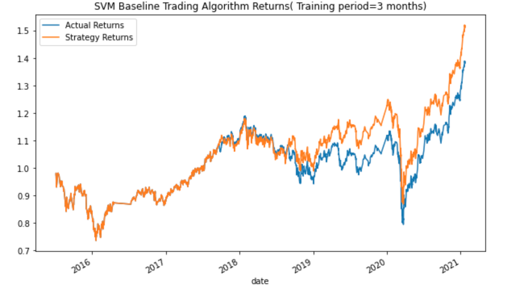

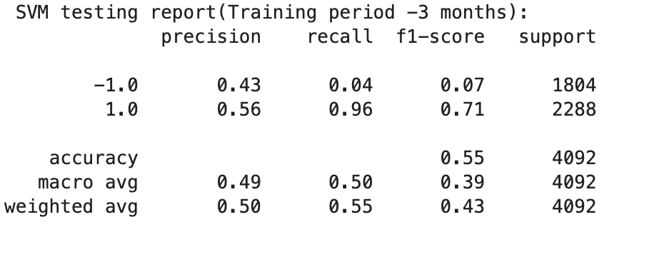

The baseline model has an `accuracy score` of `0.55` with recall of `0.96` for classification category `1` and `0.04` for classification category`-1`.

The cumulative return plot shows that strategy returns reached `1.5` whereas `actual returns` reached `1.4` in the later period.

### Tuned models and performances:

####  *Adjusting the size of the training dataset:*

#### `Training data period: 6 months`

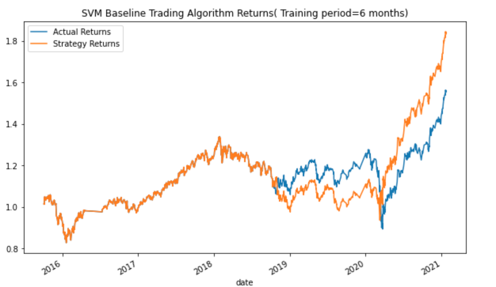


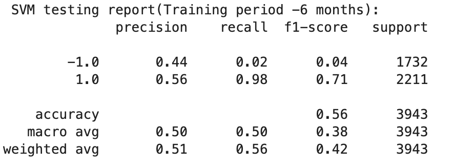


#### `Training data period: 9 months`


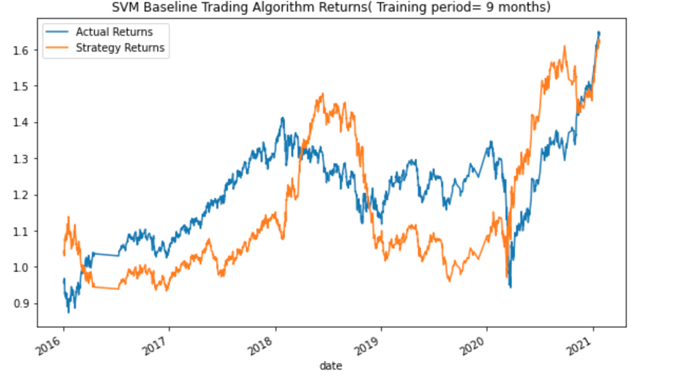


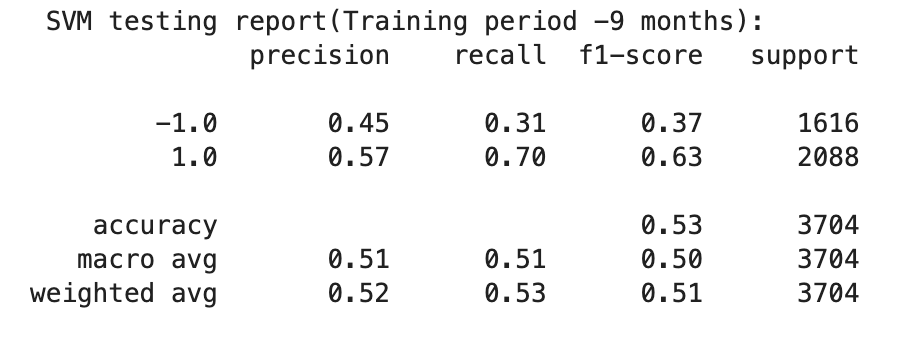


#### `Training data period: 11 months`


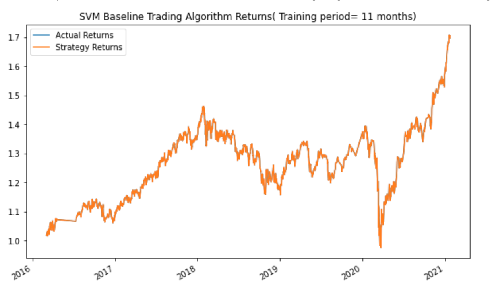


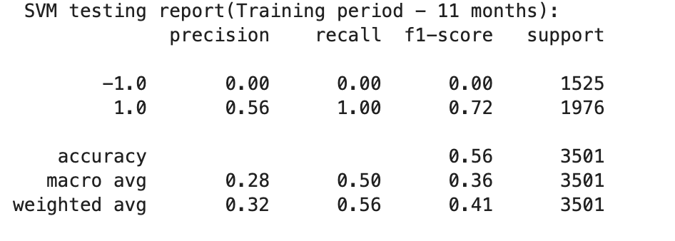


#### *What impact resulted from increasing or decreasing the training window?*

* By tuning the baseline model by adjusting the size of the training dataset to 6 months, 9 months and 11 months from 3 months, we observe that accuracy score improved by just 1 percent at `6 months` and `cumulative returns improved to 1.8` but further started dropping on increasing the duartion of training dataset. Also, recall scores did not improve much for classification category `-1` except at 9 months where accuracy score dropped with drop in recall score for classification category `1`.`

* Looking at the plots, it is clear that the cumulative strategy returns surpassed actual returns at training dataset of 6 months but dropped further on increasing the duration.

Thus the 3 months duration of baseline model for training data looks best of all the durations tried above.


#### *Adjusting the SMA input features:*

* (Keeping best period for training dataset- 3 months)


* `Short window(SMA_fast)= 10 days`


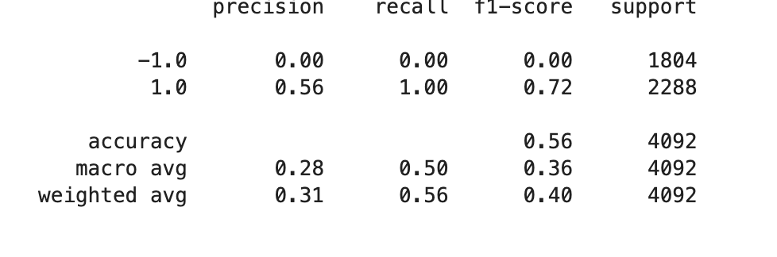

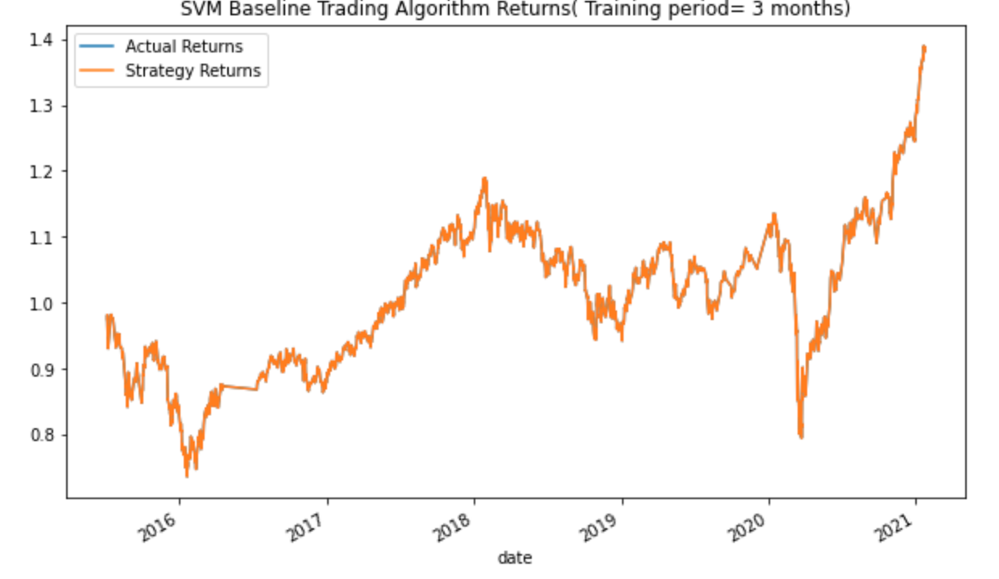


* `Short window(SMA_fast)= 30 days`


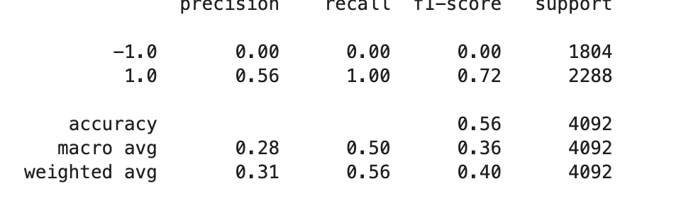

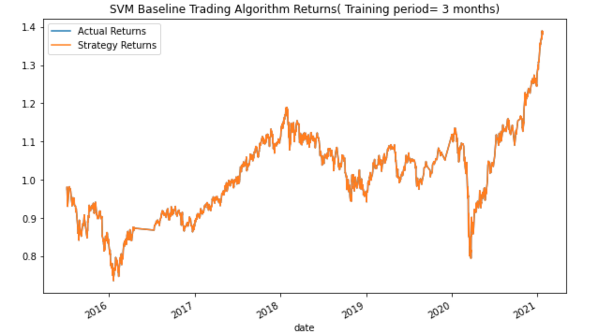

* `Long window(SMA_Slow)= 80 days`

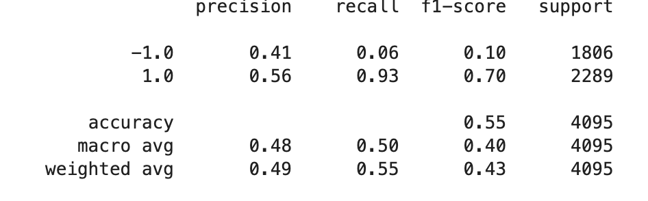

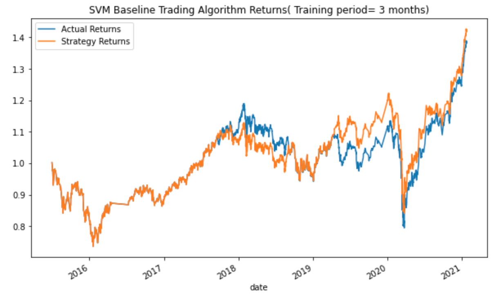


* `Long window(SMA_Slow)= 120 days`

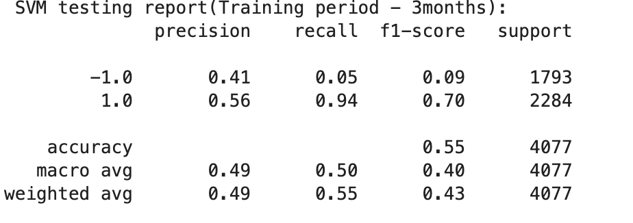

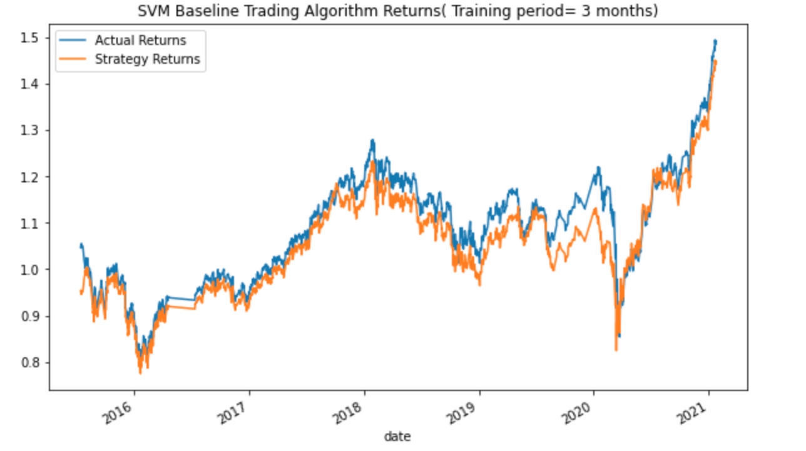

*`Short window (SMA_Fast) = 10 days, Long window (SMA_Slow) = 120 days`


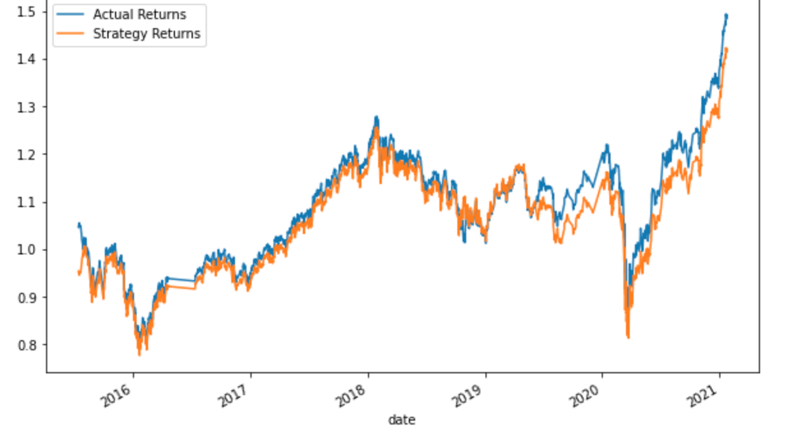


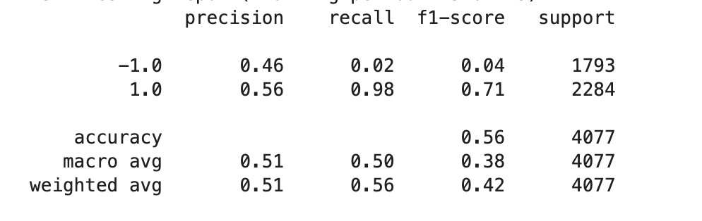

#### *What impact resulted from increasing or decreasing either or both of the SMA windows?*
(Keeping best period for training dataset- 3 months)

* Increasing the SMA short window from days to 10 days and 30 days resulted in bit improvement on accuracy score by 1 percent to 0.56, but no improvement in cumulative strategy returns. Also, the precision, recall and F1 score for classification category `-1` has been 0 for both the SMA windows.

* Decreasing the SMA long window to 80 days kept the accuracy score constant at 0.55 as compared to baseline model but resulted in liitle improvement for the scores for classification category `-1`, whwerein plot further suggests many of the times the strategy returns surpassed the actual returns.

* Increasing the SMA long window to 120 days although did not result in drop in accuracy score and other scores but almost all of the times strategy returns were below actual returns.

* Increasing the SMA short window as well as long window to 10 days and 120 days respectively, also did not result in any improvement in accuracy score and other scores.Also, all of the times strategy returns were below actual returns.

Hence, the SMA short window of 4 days and SMA long window of 100 days as in the baseline model gave the best results so far.

* `After tuning the baseline with all the changes in various parameters like training and testing dataset, SMA short and long windows, we observe that there has been improvement to the performance of the the baseline model(training period= 3months, SMA short window= 4days, SMA long window= 100 days) only with changes in training dataset to 6 months which provides the best performance with  accuracy scores(0.56) and improvement in cumulative strategy retruns to 1.8.
(Refer to plot and classification report above)


### Evaluate a New Machine Learning Classifier- LogisticRegression:

Keeping the original data as is from the baseline algorithm i.e. training dataset period to 3 months, SMA short window as 4 days and SMA Long window as 100 days, a new Logistic Regression classifier model is fitted the baseline data and predictions are made. The performance results are as below:


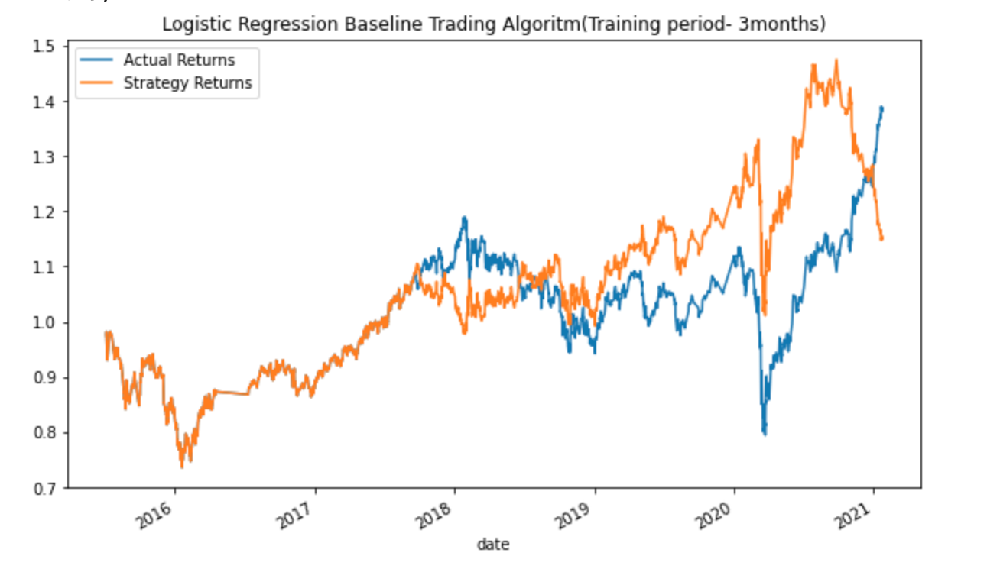


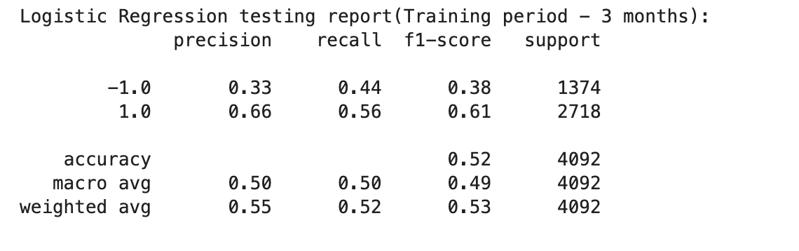


* The new classifier model provided accuracy score of 0.52 as compared to 0.55 of the baseline model. The recall score improved for the classification category `-1` to 0.44 from 0.04 whereas it dropped for classification category `1` to 0.56 from 0.96.

* The cumulative startegy returns in the new model didnot move in consistence with the actual returns and also dropped as compared to baseline model(SVM) at the later period.


### Evaluation Report:

The algorthmic trading model was tried with `SVC` and `LogiscticRegression` classifier machine learning models with the baseline parameters.

The `SVC` baseline model provided `accuracy score` of `0.55` with `recall` of `0.96` for classification category `1` and `0.04` for classification category`-1`.The cumulative return plot shows that `strategy returns` reached `1.5` whereas actual returns reached 1.4 in the later period.


The tuned SVC  baseline model with training dataset of 6 months provides the best performance with  accuracy scores(0.56) and improvement in cumulative strategy retruns to 1.8.


The `LogiscticRegression` model performed worst with dropped accuracy score  of 0.52 and dropped cumulative strategy returns.

## Technologies and Modules

This tool leverages python 3.7 with the following packages:

* [pandas] (https://pandas.pydata.org/docs/getting_started/index.html)- for data analysis
* [scikit-learn] (https://scikit-learn.org/stable/)- open source machine learning library
* [pathlib] (https://docs.python.org/3/library/pathlib.html#module-pathlib)- to read file path
* [tensorflow] (https://www.tensorflow.org/api_docs/python/tf/keras)- open source platform for machine learning
* [jupyter lab] (https://jupyterlab.readthedocs.io/en/stable/)- to work with notebooks, code, data and plots

## Installation Guide

```
conda install pandas
pip install --upgrade tensorflow
conda install -c intel scikit-learn

```

## Contributor

Shivangi Gupta

## License

MIT


